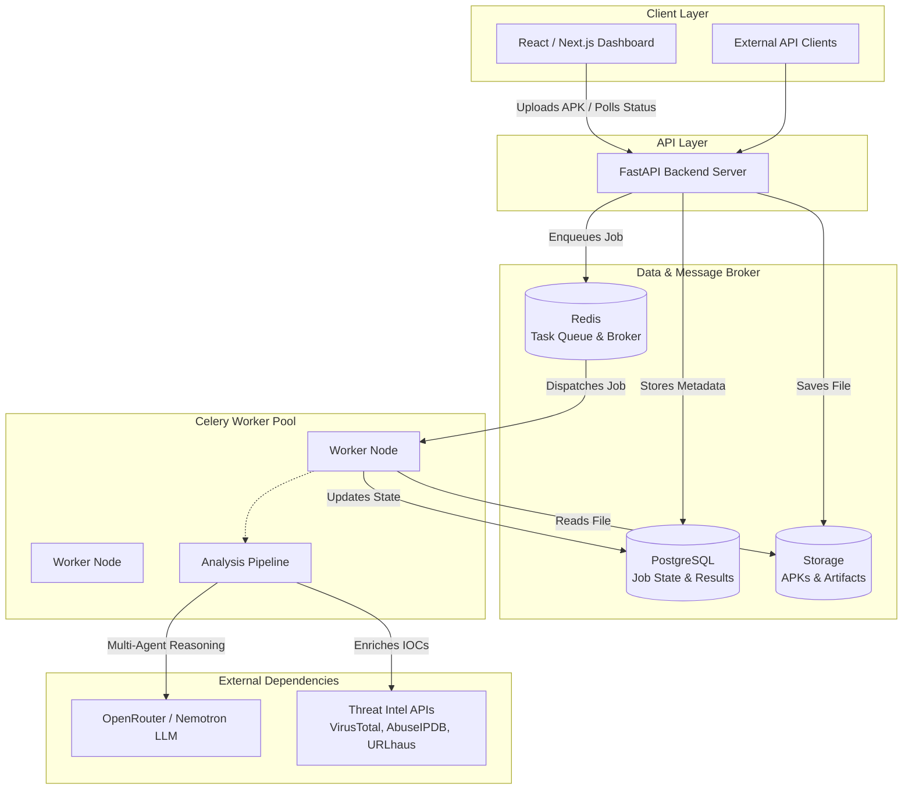
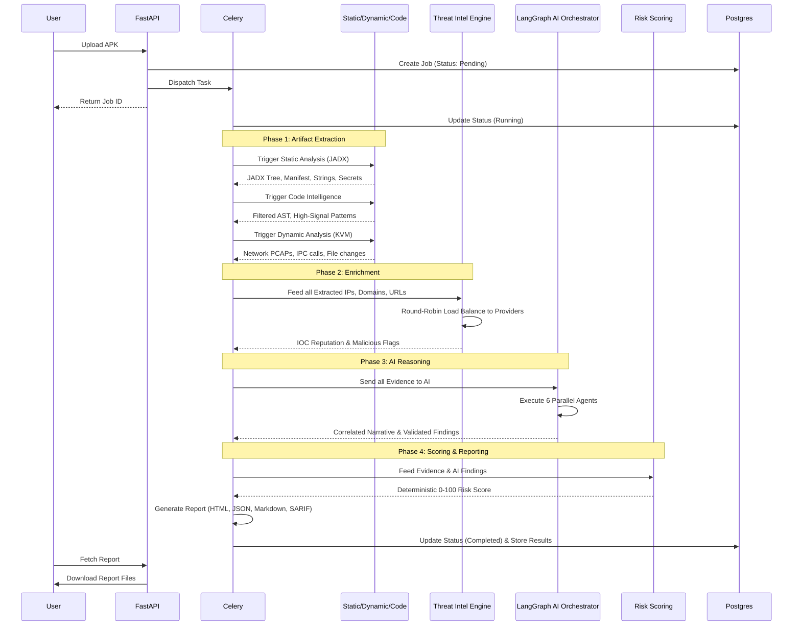
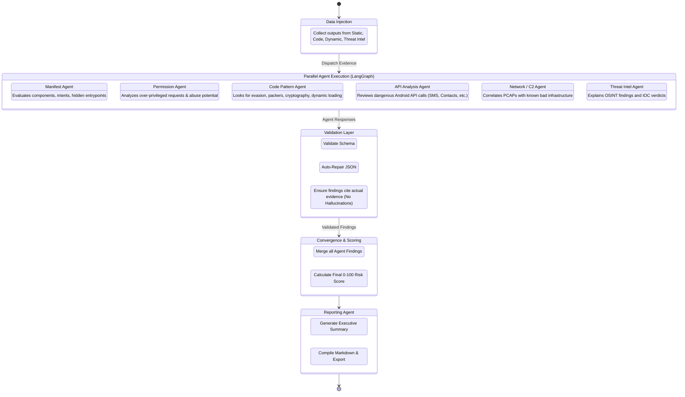
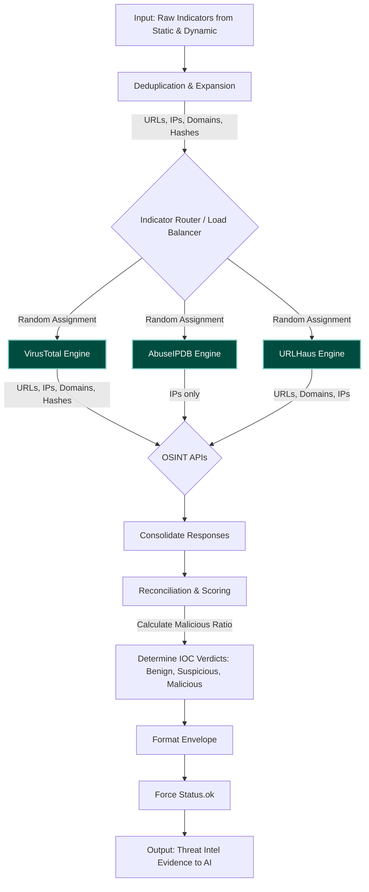

# Sephela: Comprehensive Architecture & Flow Diagrams

This document contains detailed architectural diagrams visualizing how Sephela ingests APKs, distributes work across analytical engines, and leverages a LangGraph-powered Multi-Agent GenAI system to generate cyber-risk reports.

## 1. High-Level System Architecture

This diagram illustrates the macro-level dependencies between the core components of the platform: the Frontend, Backend API, Message Queues, Databases, and the Asynchronous Celery Workers processing the APKs.



---

## 2. End-to-End Pipeline Data Flow

This outlines the chronological lifecycle of an APK analysis job. Each stage produces specific evidence that acts as input for the next stage.



---

## 3. LangGraph Multi-Agent Orchestration

Sephela uses **LangGraph** to manage a complex multi-agent reasoning workflow. Instead of using one massive prompt, the system spins up 6 specialized LLM agents that run **in parallel**. They independently evaluate their specific domain before the pipeline converges.



---

## 4. Threat Intel Engine: Data Flow & Load Balancing

This diagram details the inner workings of the Threat Intel engine, specifically highlighting the custom round-robin load balancer implemented to distribute indicators across OSINT APIs and bypass rate limits.



---

## 5. Dependency Diagram

A structural view of the libraries and technologies driving the platform.

```mermaid
graph LR
    subgraph Frontend
        React
        NextJS
        TailwindCSS
    end

    subgraph Backend Core
        FastAPI
        Celery
        SQLAlchemy
        Pydantic
    end
    
    subgraph AI Subsystem
        LangGraph
        LangChain
        OpenRouter[OpenRouter API]
        Nemotron[Nvidia Nemotron Model]
    end
    
    subgraph Analysis Engines
        JADX[JADX Decompiler]
        Androguard[Androguard]
        Weasyprint[Weasyprint PDF]
    end
    
    subgraph Infrastructure
        Postgres[(Postgres 16)]
        Redis[(Redis 7)]
        Prometheus[Prometheus Metrics]
        Grafana[Grafana Dashboards]
    end
    
    Backend Core --> AI Subsystem
    Backend Core --> Analysis Engines
    Backend Core --> Infrastructure
    Frontend --> Backend Core
    
    LangGraph --> LangChain
    LangChain --> OpenRouter
    OpenRouter --> Nemotron
```
